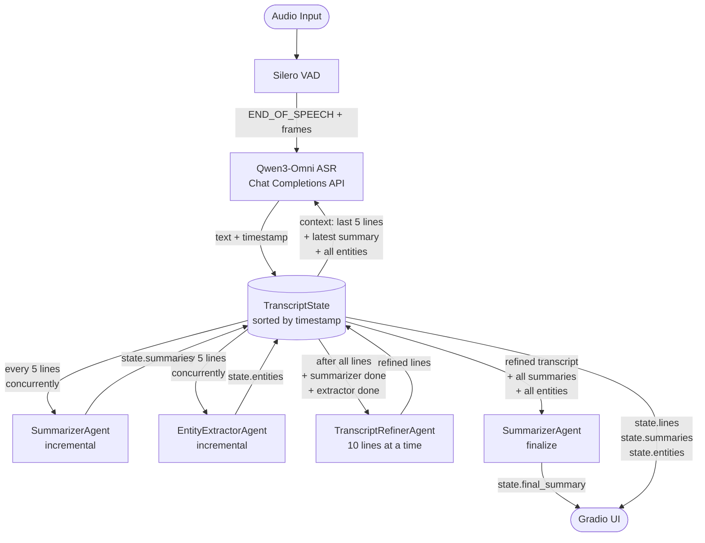

# Omni Notes

An AI-powered notetaking app that transcribes audio (file upload or mic), generates incremental summaries, extracts named entities, and produces a final refined transcript and consolidated summary.

Built with Gradio, LiveKit Agents, Silero VAD, and Qwen3-Omni.

## Features

- **Speaker diarization**: Identifies and labels different speakers using SpeechBrain's ECAPA-TDNN model. Output: `[MM:SS](speaker X) text`
- **Verbatim ASR**: Transcribes speech in the original language using Qwen3-Omni's Chat Completions API with audio input.
- **Context-aware transcription**: Each speech segment is transcribed with the last 5 lines, latest summary, and all known entities as context.
- **Incremental summarization**: Summary updated every 5 transcript lines, concurrently with entity extraction.
- **Entity extraction**: Tracks people, organizations, locations, dates, key terms, and products — every 5 lines.
- **Transcript refinement**: After transcription, lines are corrected in batches of 10 using the full entity and summary context.
- **Final summary**: One consolidated meeting summary generated from all incremental summaries and the refined transcript.
- **Gradio UI**: File upload or live microphone input.

## Pipeline



## Architecture

| File | Role |
|------|------|
| `app.py` | Gradio web UI, entry point |
| `pipeline.py` | Orchestrates all agents, drives the end-to-end flow |
| `core/state.py` | `TranscriptState` — shared store, timestamp-sorted insertion, 5-line trigger, speaker tracking |
| `agents/transcriber.py` | Silero VAD → Qwen3-Omni ASR + speaker diarization, self-contained with context prompt |
| `agents/speaker_diarizer.py` | SpeechBrain ECAPA-TDNN speaker embedding extraction & clustering |
| `agents/summarizer.py` | Incremental LLM summarization + `finalize()` for final summary |
| `agents/entities_extractor.py` | Incremental LLM entity extraction |
| `agents/refiner.py` | Post-processing refinement pass in batches of 10 |

## Installation

```bash
pip install -r requirements.txt
```

Create a `.env` file:

```env
QWEN_OMNI_BASE_URL=http://<host>/v1
QWEN_OMNI_API_KEY=sk-...
QWEN_OMNI_MODEL=qwen3-omni
QWEN_ASR_URL=https://api.winrex-ai.com/v1
QWEN_ASR_API_KEY=sk-...
QWEN_ASR_MODEL=Qwen/Qwen3-ASR-1.7B

# Speaker diarization threshold (optional, default: 0.5)
# Lower values (0.3-0.5): Stricter matching, MORE separate speakers
# Higher values (0.6-0.8): Lenient matching, FEWER total speakers
SPEAKER_EMBEDDING_THRESHOLD=0.5
```

## Usage

```bash
# Web UI
python app.py

# Offline verification
python verify_pipeline.py
```

## Speaker Diarization

Transcripts include speaker labels showing who said what:

```
[0:15](speaker 1) Hello, how are you?
[0:20](speaker 2) I'm doing great!
[0:25](speaker 1) That's awesome.
```

### Threshold Configuration

Adjust how strictly speakers are grouped:

**Via environment variable:**
```bash
export SPEAKER_EMBEDDING_THRESHOLD=0.5
python app.py
```

**Threshold values:**
- `0.3-0.5`: **Stricter** matching → more separate speakers (17+ speakers)
- `0.5` (default): **Balanced** → typical conversation (~9 speakers)
- `0.6-0.8`: **Lenient** matching → fewer total speakers

The model uses SpeechBrain's ECAPA-TDNN (~260MB, auto-downloaded on first run).
