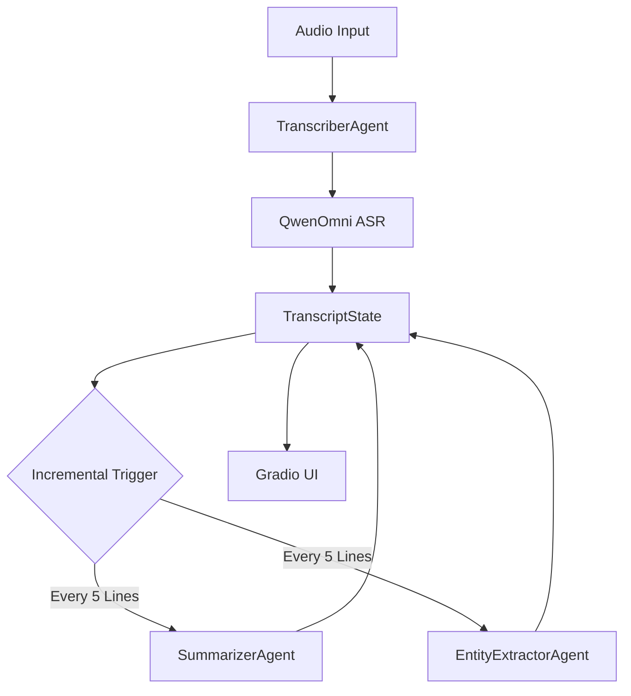

# Streaming Notetaker Walkthrough

The Streaming Notetaker is a real-time audio processing pipeline that transcribes speech, generates summaries, and extracts key entities using the QwenOmni model and LiveKit Agents.

## 🚀 Accomplishments

- **Asynchronous Pipeline**: Built a coordinated pipeline using [TranscriberAgent](file:///Users/josephcheng/Projects/notetaking/agents/transcriber.py#10-77), [SummarizerAgent](file:///Users/josephcheng/Projects/notetaking/agents/summarizer.py#7-52), and [EntityExtractorAgent](file:///Users/josephcheng/Projects/notetaking/agents/entities_extractor.py#7-54).
- **Standalone QwenOmni Integration**: Implemented custom [QwenSTT](file:///Users/josephcheng/Projects/notetaking/qwen_stt.py#108-142) using the Chat Completions API with `input_audio` for high-precision transcription.
- **Incremental Intelligence**: Intelligence agents (Summarizer/Extractor) trigger automatically every 5 transcript lines.
- **Thread-Safe State**: Centralized [TranscriptState](file:///Users/josephcheng/Projects/notetaking/core/state.py#3-71) coordinates all data and prevents overlapping LLM jobs.
- **Gradio Interface**: Modern UI for live transcription, summaries, and entity display.

## 🏗️ Architecture



## ✅ Verification Results

The pipeline was verified using [verify_pipeline.py](file:///Users/josephcheng/Projects/notetaking/verify_pipeline.py) with [test.wav](file:///Users/josephcheng/Projects/notetaking/test.wav).

### Transcription
Transcriptions are captured in real-time. For [test.wav](file:///Users/josephcheng/Projects/notetaking/test.wav), the model correctly identified placeholders and phrases.

### Summarization
Summaries are generated incrementally.
> [!NOTE]
> Example Summary:
> "The audio contains short, fragmented sentences... Technical references (e.g., “local API handle,” “AI,” “LLM,” “VM”) suggest a possible tech or AI-related context."

### Entity Extraction
Entities are extracted and categorized.
> [!TIP]
> Extracted Entities:
> - **People**: VM
> - **Organizations**: Google
> - **Key terms**: API, LLM, VM, AI

## 🛠️ How to Run

1.  **Install Dependencies**:
    ```bash
    pip install -r requirements.txt
    ```
2.  **Set Environment Variables**:
    Create a [.env](file:///Users/josephcheng/Projects/notetaking/.env) file with `QWEN_API_KEY`, `QWEN_BASE_URL`, and `QWEN_MODEL`.
3.  **Run the App**:
    ```bash
    python app.py
    ```
4.  **Verify Offline**:
    ```bash
    python verify_pipeline.py
    ```
